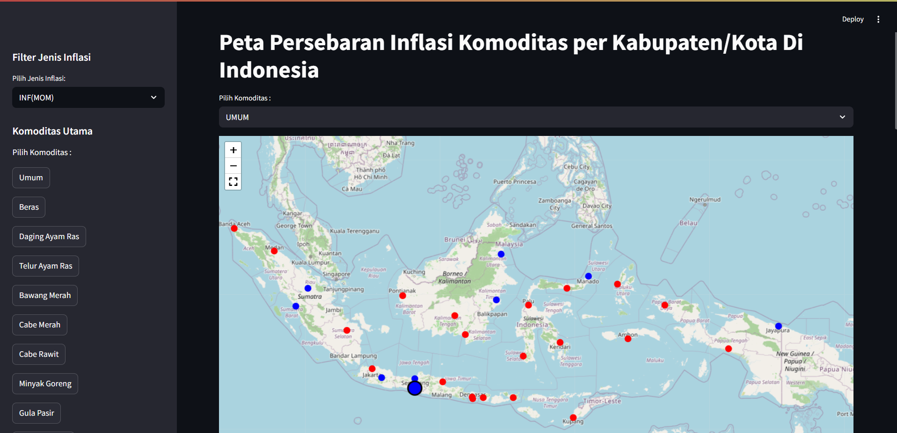

Proyek ini adalah *dashboard* interaktif untuk memvisualisasikan kontribusi inflasi dan deflasi komoditas secara *month-to-month* di berbagai Kabupaten/Kota di Indonesia. 

Proyek ini dikerjakan selama masa magang di **BPS Kota Yogyakarta**.
*(Catatan: Data asli bersifat rahasia dan tidak dipublikasikan. Repository ini menggunakan data dummy untuk keperluan demonstrasi).*

## 🛠️ Tech Stack
*   **Bahasa:** Python
*   **Framework/Library:** Streamlit, Pandas, [sebutkan library mapping misal: Folium/Plotly]

## 🚀 Cara Menjalankan Secara Lokal
1. Clone repository ini:
   `git clone https://github.com/alfants/Inflation-Deflation-Maps-Distribution-In-Indonesia.git`
2. Install dependencies:
   `pip install -r requirements.txt`
3. Run ipynb file:
   click `Run All` diatas kernel
4. Jalankan dashboard:
   `streamlit run web.py`

## 📸 Dashboard Preview
